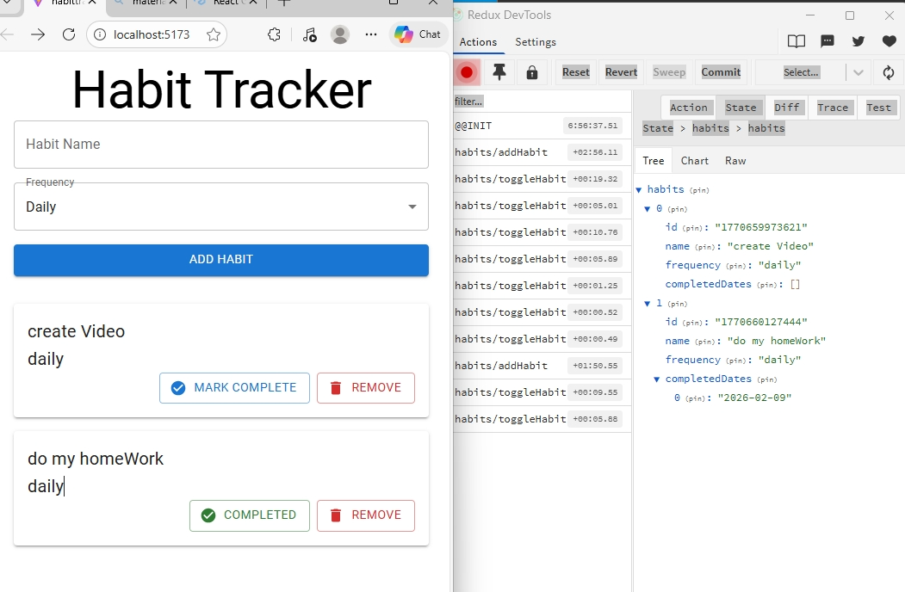

# Habit Tracker App 🧠✅

A simple and clean Habit Tracker application built with **React** and **Redux Toolkit**.  
This project was created to practice global state management, component architecture, and modern UI development using **Material UI**.

---

## 🚀 Features

- Add new habits
- Mark habits as completed / uncompleted
- Delete habits
- Track daily habit progress
- Global state management with Redux Toolkit
- Clean and responsive UI with Material UI

---

## 🛠 Tech Stack

- **React**
- **Redux Toolkit**
- **React Redux**
- **Material UI (MUI)**
- **JavaScript (ES6+)**

---

## 📂 Project Structure

```

src/
├── app/
│   └── store.js
├── features/
│   └── habits/
│       ├── habitsSlice.js
│       └── HabitsList.jsx
├── components/
│   └── HabitForm.jsx
├── pages/
│   └── Home.jsx
├── App.jsx
└── main.jsx

````

---

## 🧩 Redux Logic

The application uses **Redux Toolkit** for state management:
- `createSlice` for habits logic
- Centralized store configuration
- Actions and reducers handled in a clean, scalable way

---

## 📦 Installation & Setup

1. Clone the repository:
```bash
git clone https://github.com/mariembenhassen/habit-tracker.git
````

2. Navigate to the project folder:

```bash
cd habit-tracker
```

3. Install dependencies:

```bash
npm install
```

4. Start the development server:

```bash
npm run dev
```

## 🎯 Learning Goals

This project was built to:

* Understand Redux Toolkit fundamentals
* Practice React + Redux integration
* Learn how to structure scalable React applications
* Improve UI development using Material UI

---
## Redux DevTools 
Add it as a browser extentions where you can see the actionsand state ..



## 👩‍💻 Author

**Mariem Ben Hassen**

## 📄 License

This project is open-source and available under the MIT License.

